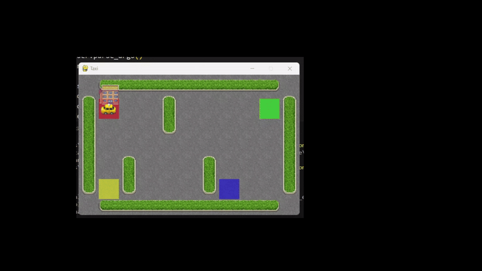
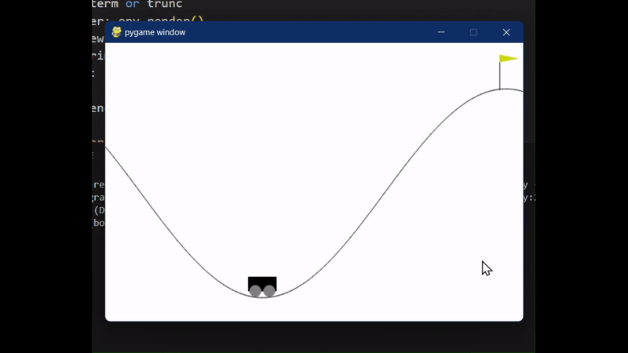

# q-learning-and-sarsa-lambda

- Read the [report here](./report.pdf) and the [requirement's file here](./2-assignment-ppt.pdf)
- To setup a Virtual Environment, where you can install and run the script, follow the instructions in the [Virtual Environment MD file](./virtual_env_setup.md)

## SARSA Lambda

- To run the script and render it, run the following command

```bash
python ./sara_lambda/main.py --render
```

<!--  -->
<div align=center></div>

## Q-Learning with Radial Basis Function (RBF)

```bash
python ./rbf/main.py -t='./rbf/model.pkl' -e='./rbf/model.pkl' --render
```

<div align=center></div>
<!--  -->